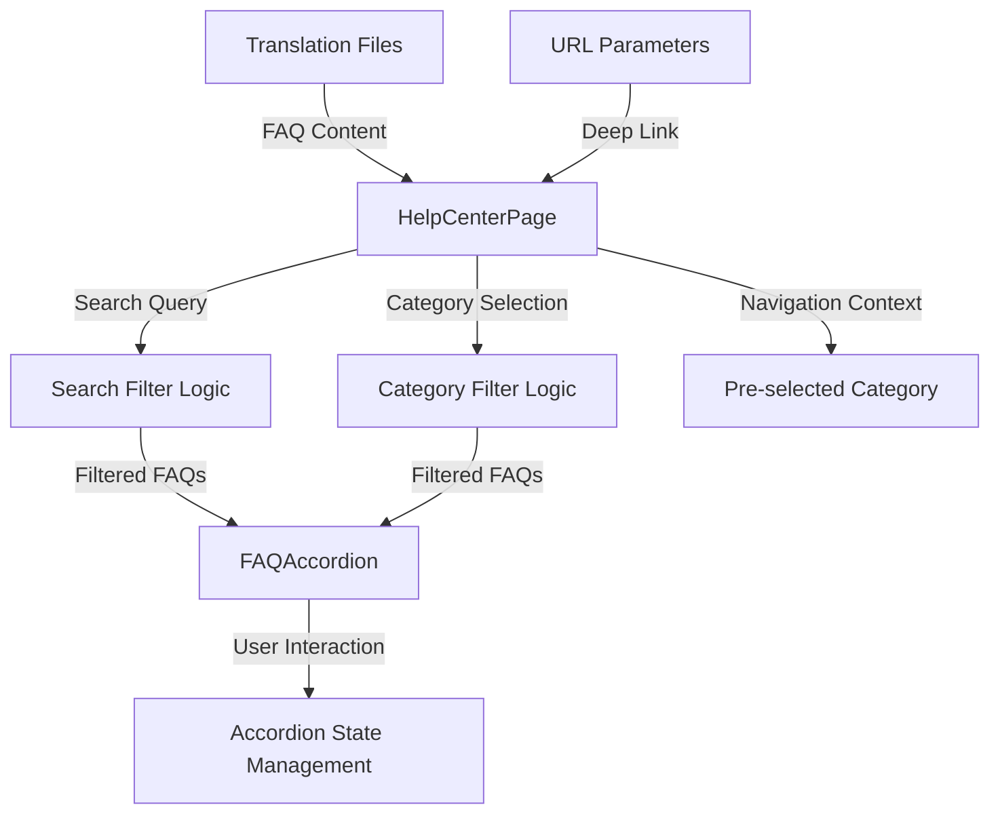

# Design Document: FAQ/Help Center

## Overview

The FAQ/Help Center is a comprehensive self-service support feature for MockupSuite that provides users with answers to common questions about the platform. The design follows the existing application patterns, using React with TypeScript, Tailwind CSS for styling, and the established translation system for multi-language support.

The Help Center will be implemented as a standalone page component that can be accessed from the main navigation. It features an accordion-based FAQ display, real-time search functionality, category filtering, and a prominent call-to-action for users who need additional support.

## Architecture

### Component Hierarchy

```
HelpCenterPage (Main Container)
├── HelpCenterHeader
│   ├── PageHeading
│   └── SearchBar
├── CategoryFilter
│   └── CategoryChip[]
├── FAQAccordion
│   └── FAQItem[]
│       ├── QuestionHeader
│       └── AnswerContent
└── ContactSupportCTA
    ├── CTAHeading
    └── ContactButton
```

### Data Flow



## Components and Interfaces

### 1. HelpCenterPage Component

**Purpose**: Main container component that manages state and orchestrates all child components.

**Props Interface**:
```typescript
interface HelpCenterPageProps {
  initialCategory?: FAQCategory;
  initialQuestionId?: string;
  onContactSupport?: () => void;
}
```

**State Management**:
```typescript
interface HelpCenterState {
  searchQuery: string;
  selectedCategory: FAQCategory | 'all';
  expandedItems: Set<string>;
  filteredFAQs: FAQItem[];
}
```

**Key Responsibilities**:
- Initialize state from URL parameters or props
- Manage search and filter logic
- Handle accordion expand/collapse state
- Provide FAQ data to child components
- Handle deep linking and scrolling

### 2. SearchBar Component

**Purpose**: Provides real-time search functionality for FAQ content.

**Props Interface**:
```typescript
interface SearchBarProps {
  value: string;
  onChange: (value: string) => void;
  placeholder: string;
}
```

**Features**:
- Debounced search input (300ms delay)
- Clear button when text is present
- Search icon indicator
- Accessible label and ARIA attributes

### 3. CategoryFilter Component

**Purpose**: Displays category chips for filtering FAQ items.

**Props Interface**:
```typescript
interface CategoryFilterProps {
  categories: FAQCategory[];
  selectedCategory: FAQCategory | 'all';
  onCategorySelect: (category: FAQCategory | 'all') => void;
  faqCounts: Record<FAQCategory, number>;
}
```

**Features**:
- Visual distinction for active category
- Display count of FAQs per category
- Responsive wrapping on mobile
- Keyboard navigation support

### 4. FAQAccordion Component

**Purpose**: Renders the list of FAQ items with expand/collapse functionality.

**Props Interface**:
```typescript
interface FAQAccordionProps {
  faqs: FAQItem[];
  expandedItems: Set<string>;
  onToggle: (id: string) => void;
  searchQuery: string;
}
```

**Features**:
- Smooth expand/collapse animations
- Highlight search terms in content
- Keyboard navigation (Tab, Enter, Space)
- ARIA attributes for accessibility

### 5. FAQItem Component

**Purpose**: Individual FAQ accordion item with question and answer.

**Props Interface**:
```typescript
interface FAQItemProps {
  faq: FAQItem;
  isExpanded: boolean;
  onToggle: () => void;
  searchQuery: string;
}
```

**Features**:
- Animated chevron icon rotation
- Smooth height transition
- Search term highlighting
- Focus management

### 6. ContactSupportCTA Component

**Purpose**: Call-to-action section for users who need additional help.

**Props Interface**:
```typescript
interface ContactSupportCTAProps {
  onContactClick?: () => void;
}
```

**Features**:
- Prominent visual design
- Support contact information
- Email link or contact form trigger
- Responsive layout

## Data Models

### FAQ Item Structure

```typescript
interface FAQItem {
  id: string;
  category: FAQCategory;
  question: string;
  answer: string;
  keywords: string[]; // For enhanced search
  relatedQuestions?: string[]; // IDs of related FAQs
}

type FAQCategory = 
  | 'getting-started'
  | 'billing'
  | 'ai-features'
  | 'troubleshooting'
  | 'privacy';
```

### Translation Structure

The FAQ content will be stored in the translation files with the following structure:

```typescript
// In locales/en.ts, tr.ts, es.ts
export const en = {
  // ... existing translations
  
  // Help Center
  help_center_title: 'Help Center',
  help_center_subtitle: 'Have a question? Find your answer here.',
  help_center_search_placeholder: 'Search for questions...',
  help_center_contact_title: "Can't find what you're looking for?",
  help_center_contact_description: 'Our support team is always ready to help. Reach out to us for any questions you might have.',
  help_center_contact_button: 'Contact Support',
  help_center_no_results: 'No results found for "{query}". Try different keywords or browse by category.',
  
  // Categories
  faq_category_all: 'All',
  faq_category_getting_started: 'Getting Started',
  faq_category_billing: 'Billing',
  faq_category_ai_features: 'AI Features',
  faq_category_troubleshooting: 'Troubleshooting',
  faq_category_privacy: 'Privacy',
  
  // FAQ Items - Getting Started
  faq_gs_1_question: 'What is MockupSuite?',
  faq_gs_1_answer: 'MockupSuite is an AI-powered mockup generator that allows you to upload your product images and designs to create professional, high-quality photos and mockups automatically. It\'s perfect for e-commerce, marketing, and design presentations.',
  
  faq_gs_2_question: 'How do I get started with MockupSuite?',
  faq_gs_2_answer: 'Getting started is easy! Simply sign up for a free account, upload your product photo or design, describe the scene you want or select a product template, and click generate. Your professional mockup will be ready in seconds.',
  
  faq_gs_3_question: 'What types of mockups can I create?',
  faq_gs_3_answer: 'You can create two types of mockups: Scene Generation (transform product photos into studio-quality images with custom backgrounds) and Product Mockups (apply designs to templates like apparel, home goods, print materials, and tech products).',
  
  // FAQ Items - Billing
  faq_billing_1_question: 'What subscription plans do you offer?',
  faq_billing_1_answer: 'We offer four plans: Free (5 mockups/month), Starter (50 mockups/month for 299 TRY), Pro (200 mockups/month for 649 TRY), and Business (700 mockups/month for 1,199 TRY). All paid plans include high-resolution exports and no watermarks.',
  
  faq_billing_2_question: 'Can I cancel my subscription at any time?',
  faq_billing_2_answer: 'Yes, you can cancel your subscription at any time from your account settings. Your plan will remain active until the end of the current billing cycle, and you will not be charged again.',
  
  faq_billing_3_question: 'What happens when I run out of monthly quota?',
  faq_billing_3_answer: 'When your monthly quota is exhausted, you can either upgrade to a higher plan or purchase credit packages. Credits never expire and can be used anytime your quota runs out.',
  
  faq_billing_4_question: 'Do you offer refunds?',
  faq_billing_4_answer: 'We offer a 14-day money-back guarantee for first-time subscribers. If you\'re not satisfied with the service, contact our support team within 14 days of your initial purchase for a full refund.',
  
  // FAQ Items - AI Features
  faq_ai_1_question: 'What AI technology powers MockupSuite?',
  faq_ai_1_answer: 'MockupSuite uses Google\'s Gemini 2.5 Flash AI model for image generation. This advanced AI creates photorealistic mockups with perfect lighting, shadows, and perspective.',
  
  faq_ai_2_question: 'How long does it take to generate a mockup?',
  faq_ai_2_answer: 'Most mockups are generated in 10-30 seconds. Pro and Business plan subscribers get priority processing for even faster generation times.',
  
  faq_ai_3_question: 'Can I customize the generated mockups?',
  faq_ai_3_answer: 'Yes! You can customize mockups by providing detailed scene descriptions, selecting different product templates, choosing colors, and applying style presets. The more specific your description, the better the results.',
  
  faq_ai_4_question: 'What file formats are supported for uploads?',
  faq_ai_4_answer: 'We support JPEG, PNG, WEBP, and GIF formats. For best results, we recommend uploading high-resolution images with a clean background. Maximum file size is 10MB.',
  
  // FAQ Items - Troubleshooting
  faq_trouble_1_question: 'Why is my mockup generation failing?',
  faq_trouble_1_answer: 'Generation failures can occur due to several reasons: poor image quality, unsupported file format, network issues, or quota exhaustion. Check your file format, ensure you have remaining quota, and try again with a stable internet connection.',
  
  faq_trouble_2_question: 'The generated mockup doesn\'t match my description. What should I do?',
  faq_trouble_2_answer: 'Try being more specific in your description. Include details about lighting, background, perspective, and style. You can also use our prompt templates or suggestion feature for inspiration.',
  
  faq_trouble_3_question: 'How do I improve the quality of generated mockups?',
  faq_trouble_3_answer: 'Upload high-resolution source images, provide detailed and specific descriptions, use the style presets, and consider upgrading to Pro or Business plans for maximum resolution (up to 4K).',
  
  faq_trouble_4_question: 'My images are not loading in the gallery. What should I do?',
  faq_trouble_4_answer: 'This is usually a temporary issue. Try refreshing the page, clearing your browser cache, or checking your internet connection. If the problem persists, contact our support team.',
  
  // FAQ Items - Privacy
  faq_privacy_1_question: 'How is my data and privacy protected?',
  faq_privacy_1_answer: 'We take data privacy very seriously. All uploaded images and generated content are encrypted and stored securely using Supabase. We do not use your data for any purpose other than providing the service to you. Please see our Privacy Policy for full details.',
  
  faq_privacy_2_question: 'Who owns the generated mockups?',
  faq_privacy_2_answer: 'You retain full ownership and commercial rights to all mockups you generate using MockupSuite. You can use them for any purpose, including commercial projects, without attribution.',
  
  faq_privacy_3_question: 'Do you share my images with third parties?',
  faq_privacy_3_answer: 'No, we never share your images with third parties. Your uploads and generated mockups are private and only accessible to you through your account.',
  
  faq_privacy_4_question: 'Can I delete my data?',
  faq_privacy_4_answer: 'Yes, you can delete individual mockups from your gallery at any time. If you want to delete your entire account and all associated data, contact our support team and we\'ll process your request within 30 days.',
};
```

## Error Handling

### Error Scenarios

1. **No Search Results**
   - Display: "No results found for '{query}'. Try different keywords or browse by category."
   - Action: Show all categories for browsing

2. **Failed to Load FAQs**
   - Display: "Failed to load help content. Please refresh the page."
   - Action: Provide refresh button

3. **Invalid Deep Link**
   - Display: Redirect to help center home with all FAQs visible
   - Action: Log warning in console

4. **Contact Support Failure**
   - Display: "Unable to open contact form. Please email us at support@mockupsuite.com"
   - Action: Show email address as fallback

### Error Handling Pattern

```typescript
try {
  // Load FAQ data from translations
  const faqs = loadFAQsFromTranslations();
} catch (error) {
  console.error('Failed to load FAQ data:', error);
  // Show error state with retry button
  return <ErrorState onRetry={handleRetry} />;
}
```

## Testing Strategy

### Unit Tests

1. **Search Functionality**
   - Test search filtering with various queries
   - Test search highlighting in results
   - Test debounce behavior
   - Test empty search results

2. **Category Filtering**
   - Test category selection
   - Test "All" category behavior
   - Test category counts
   - Test combined search + category filter

3. **Accordion Behavior**
   - Test expand/collapse functionality
   - Test multiple items expanded simultaneously
   - Test keyboard navigation
   - Test focus management

4. **Deep Linking**
   - Test URL parameter parsing
   - Test navigation to specific category
   - Test navigation to specific question
   - Test invalid parameter handling

### Integration Tests

1. **Translation Integration**
   - Test FAQ content loads in all supported languages
   - Test language switching updates FAQ content
   - Test missing translation fallback

2. **Navigation Integration**
   - Test navigation from pricing page pre-selects billing category
   - Test navigation from generator pre-selects AI features category
   - Test back button behavior

3. **Responsive Behavior**
   - Test layout on mobile (320px)
   - Test layout on tablet (768px)
   - Test layout on desktop (1920px)
   - Test touch interactions on mobile

### Accessibility Tests

1. **Keyboard Navigation**
   - Test Tab navigation through all interactive elements
   - Test Enter/Space to expand/collapse accordions
   - Test Escape to close expanded items
   - Test focus visible indicators

2. **Screen Reader**
   - Test ARIA labels and roles
   - Test state announcements
   - Test heading hierarchy
   - Test landmark regions

3. **Color Contrast**
   - Test contrast ratios in light mode
   - Test contrast ratios in dark mode
   - Test focus indicators visibility

## Implementation Details

### Search Algorithm

```typescript
function searchFAQs(faqs: FAQItem[], query: string): FAQItem[] {
  if (!query.trim()) return faqs;
  
  const lowerQuery = query.toLowerCase();
  
  return faqs.filter(faq => {
    // Search in question
    if (faq.question.toLowerCase().includes(lowerQuery)) return true;
    
    // Search in answer
    if (faq.answer.toLowerCase().includes(lowerQuery)) return true;
    
    // Search in keywords
    if (faq.keywords.some(keyword => 
      keyword.toLowerCase().includes(lowerQuery)
    )) return true;
    
    return false;
  });
}
```

### Highlight Search Terms

```typescript
function highlightText(text: string, query: string): React.ReactNode {
  if (!query.trim()) return text;
  
  const parts = text.split(new RegExp(`(${query})`, 'gi'));
  
  return parts.map((part, index) => 
    part.toLowerCase() === query.toLowerCase() ? (
      <mark key={index} className="bg-primary/20 text-gray-900 dark:text-white">
        {part}
      </mark>
    ) : (
      part
    )
  );
}
```

### Deep Linking

```typescript
function useDeepLink() {
  const [searchParams] = useSearchParams();
  
  useEffect(() => {
    const category = searchParams.get('category');
    const questionId = searchParams.get('question');
    
    if (category) {
      setSelectedCategory(category as FAQCategory);
    }
    
    if (questionId) {
      setExpandedItems(new Set([questionId]));
      // Scroll to question after render
      setTimeout(() => {
        document.getElementById(`faq-${questionId}`)?.scrollIntoView({
          behavior: 'smooth',
          block: 'center'
        });
      }, 100);
    }
  }, [searchParams]);
}
```

### Responsive Design Breakpoints

```typescript
// Tailwind breakpoints used
const breakpoints = {
  sm: '640px',   // Small devices
  md: '768px',   // Medium devices
  lg: '1024px',  // Large devices
  xl: '1280px',  // Extra large devices
};

// Layout adjustments
// Mobile (< 640px): Single column, stacked layout
// Tablet (640px - 1024px): Optimized spacing, wrapped chips
// Desktop (> 1024px): Full layout with max-width container
```

### Animation Specifications

```css
/* Accordion expand/collapse */
.accordion-content {
  transition: max-height 0.3s ease-in-out, opacity 0.2s ease-in-out;
}

/* Chevron rotation */
.chevron-icon {
  transition: transform 0.3s ease-in-out;
}

.chevron-icon.expanded {
  transform: rotate(180deg);
}

/* Category chip hover */
.category-chip {
  transition: background-color 0.2s ease, color 0.2s ease;
}
```

## Performance Considerations

1. **Search Debouncing**: 300ms delay to prevent excessive filtering
2. **Lazy Loading**: FAQ content loaded from translations on mount
3. **Memoization**: Use React.memo for FAQ items to prevent unnecessary re-renders
4. **Virtual Scrolling**: Not needed initially (< 50 FAQs), but can be added if FAQ list grows significantly

## Security Considerations

1. **XSS Prevention**: All FAQ content from translations is sanitized
2. **Deep Link Validation**: URL parameters are validated before use
3. **Contact Form**: If implemented, include CSRF protection and rate limiting

## Future Enhancements

1. **FAQ Analytics**: Track which questions are most viewed/searched
2. **Related Questions**: Show related FAQs at the bottom of each answer
3. **Feedback System**: "Was this helpful?" buttons on each FAQ
4. **AI-Powered Search**: Use semantic search for better results
5. **Video Tutorials**: Embed video content in FAQ answers
6. **Live Chat Integration**: Add live chat widget for real-time support
7. **FAQ Voting**: Allow users to upvote helpful FAQs
8. **Multi-step Guides**: Convert complex FAQs into step-by-step tutorials
