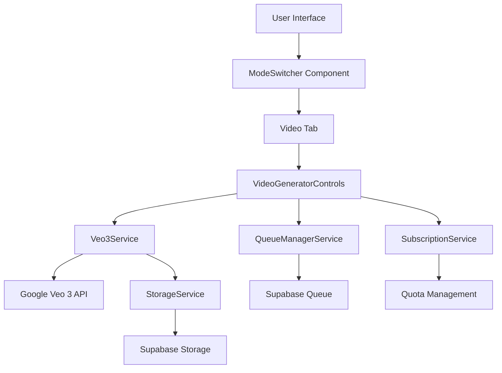

# Design Document

## Overview

This design document outlines the implementation of video generation capabilities using Google's Veo 3 AI model. The feature will be integrated into the existing MockupSuite application as a third mode alongside "Scene Generation" and "Product Mockup" modes. Users will be able to generate short promotional videos from their product images through an intuitive tab-based interface.

## Architecture

### High-Level Architecture



### Component Hierarchy

```
App.tsx
├── ModeSwitcher (updated to include 'video' mode)
├── GeneratorControls (updated to handle video mode)
│   ├── VideoGeneratorControls (new)
│   │   ├── ImageUploader (reused)
│   │   ├── VideoPromptInput (new)
│   │   └── VideoOptionsSelector (new)
│   └── [existing scene/product controls]
└── GeneratedVideo (new - provided by user)
```

## Components and Interfaces

### 1. Type Definitions (types.ts)

Add new types for video generation:

```typescript
// Add to AppMode type
export type AppMode = 'scene' | 'product' | 'video';

// New video-specific types
export interface VideoResult {
  source: UploadedImage;
  generatedUrl: string; // URL to video file in storage
  duration?: number; // video duration in seconds
  createdAt: string;
}

export interface VideoGenerationRequest {
  userId: string;
  projectId?: string;
  prompt: string;
  sourceImage: string; // base64
  duration?: number; // requested duration (5-10 seconds)
  aspectRatio?: '16:9' | '9:16' | '1:1';
}

export interface VideoQueueItem extends QueueItem {
  requestData: {
    prompt: string;
    images: string[];
    aspectRatio?: string;
    duration?: number;
    videoGeneration: true; // flag to identify video requests
  };
  resultData?: {
    videoUrl: string;
    duration: number;
  };
}
```

### 2. ModeSwitcher Component (Update)

Update to include video mode:

```typescript
const modes: { id: AppMode; labelKey: string }[] = [
  { id: 'scene', labelKey: 'mode_scene' },
  { id: 'product', labelKey: 'mode_product' },
  { id: 'video', labelKey: 'mode_video' }, // NEW
];

// Update grid layout from w-1/2 to w-1/3
className="w-1/3 py-2 px-3 text-sm font-semibold rounded-md..."
```

### 3. VideoGeneratorControls Component (New)

A new component for video-specific controls:

```typescript
interface VideoGeneratorControlsProps {
  sourceImage: UploadedImage | null;
  onSourceImageChange: (image: UploadedImage | null) => void;
  videoPrompt: string;
  onVideoPromptChange: (prompt: string) => void;
  videoDuration: number;
  onVideoDurationChange: (duration: number) => void;
  videoAspectRatio: '16:9' | '9:16' | '1:1';
  onVideoAspectRatioChange: (ratio: '16:9' | '9:16' | '1:1') => void;
  isLoading: boolean;
  onGenerate: () => void;
}
```

Features:
- Single image uploader (reuse ImageUploader with maxImages=1)
- Text area for video prompt
- Duration selector (5s, 7s, 10s options)
- Aspect ratio selector (16:9, 9:16, 1:1)
- Generate button

### 4. Veo3Service (New)

Service for interacting with Google Veo 3 API:

```typescript
// services/veo3Service.ts

export interface Veo3GenerationOptions {
  prompt: string;
  sourceImage: string; // base64
  duration?: number; // 5-10 seconds
  aspectRatio?: '16:9' | '9:16' | '1:1';
}

export async function generateVideo(
  options: Veo3GenerationOptions
): Promise<string> {
  // Returns base64 video data or URL
}
```

Implementation details:
- Use Google GenAI SDK similar to geminiService
- Model: 'veo-3' or appropriate Veo 3 model identifier
- Handle video response format (likely base64 or streaming)
- Error handling for API failures
- Timeout handling (video generation may take 30-60 seconds)

### 5. App.tsx Updates

Add video-specific state and handlers:

```typescript
// New state
const [videoSourceImage, setVideoSourceImage] = useState<UploadedImage | null>(null);
const [videoPrompt, setVideoPrompt] = useState<string>('');
const [videoDuration, setVideoDuration] = useState<number>(7);
const [videoAspectRatio, setVideoAspectRatio] = useState<'16:9' | '9:16' | '1:1'>('16:9');
const [currentVideoResult, setCurrentVideoResult] = useState<VideoResult | null>(null);

// New handler
const handleVideoGenerate = useCallback(async () => {
  if (!videoSourceImage || !videoPrompt.trim() || !user) {
    setError(t('error_no_image_or_prompt'));
    return;
  }

  // Check quota
  const canGenerate = await subscriptionService.canGenerateVideo(user.id);
  if (!canGenerate) {
    setUpgradeModalTrigger('quota_exhausted');
    setShowUpgradeModal(true);
    return;
  }

  setIsLoading(true);
  setError(null);
  setCurrentVideoResult(null);
  setProgressText(t('progress_text_generating_video'));

  try {
    // Add to queue
    const queueItem = await queueManagerService.addToQueue({
      userId: user.id,
      projectId: currentProject?.id,
      prompt: videoPrompt,
      images: [videoSourceImage.base64],
      aspectRatio: videoAspectRatio,
      duration: videoDuration,
      videoGeneration: true,
    });

    // Generate video
    const videoBase64 = await veo3Service.generateVideo({
      prompt: videoPrompt,
      sourceImage: videoSourceImage.base64,
      duration: videoDuration,
      aspectRatio: videoAspectRatio,
    });

    // Upload to storage
    const videoFile = base64ToFile(videoBase64, `video_${Date.now()}.mp4`, 'video/mp4');
    const videoPath = await storageService.uploadVideo(
      user.id,
      videoFile,
      'videos'
    );

    // Get signed URL
    const videoUrl = await storageService.getVideoUrl(videoPath);

    // Update queue item
    await queueManagerService.updateQueueItemStatus(
      queueItem.id,
      'completed',
      { videoUrl, duration: videoDuration }
    );

    // Set result
    setCurrentVideoResult({
      source: videoSourceImage,
      generatedUrl: videoUrl,
      duration: videoDuration,
      createdAt: new Date().toISOString(),
    });

    // Decrement quota
    await subscriptionService.decrementVideoQuota(user.id, 1);
    setQuotaRefreshTrigger(prev => prev + 1);
  } catch (e: any) {
    setError(e.message || t('error_unknown'));
    await queueManagerService.updateQueueItemStatus(
      queueItem.id,
      'failed',
      undefined,
      e.message
    );
  } finally {
    setIsLoading(false);
    setProgressText('');
  }
}, [videoSourceImage, videoPrompt, videoDuration, videoAspectRatio, user, currentProject, t]);
```

### 6. StorageService Updates

Add video upload and retrieval methods:

```typescript
// services/storageService.ts

export async function uploadVideo(
  userId: string,
  videoFile: File,
  folder: string = 'videos'
): Promise<string> {
  // Upload video to Supabase Storage
  // Return storage path
}

export async function getVideoUrl(videoPath: string): Promise<string> {
  // Get signed URL for video (1 hour expiration)
  // Cache URL for 55 minutes
}

export async function deleteVideo(videoPath: string): Promise<void> {
  // Delete video from storage
}
```

### 7. SubscriptionService Updates

Add video-specific quota methods:

```typescript
// services/subscriptionService.ts

export async function canGenerateVideo(userId: string): Promise<boolean> {
  // Check if user has video generation quota
  // Video generation may cost more credits (e.g., 5 credits per video)
}

export async function decrementVideoQuota(
  userId: string,
  count: number
): Promise<void> {
  // Decrement video generation quota
  // May deduct multiple credits per video
}

export async function getVideoQuotaInfo(userId: string): Promise<QuotaInfo> {
  // Get video-specific quota information
}
```

### 8. GeneratorControls Component Updates

Update to conditionally render video controls:

```typescript
{mode === 'video' ? (
  <VideoGeneratorControls
    sourceImage={videoSourceImage}
    onSourceImageChange={setVideoSourceImage}
    videoPrompt={videoPrompt}
    onVideoPromptChange={setVideoPrompt}
    videoDuration={videoDuration}
    onVideoDurationChange={setVideoDuration}
    videoAspectRatio={videoAspectRatio}
    onVideoAspectRatioChange={setVideoAspectRatio}
    isLoading={isLoading}
    onGenerate={handleVideoGenerate}
  />
) : mode === 'scene' ? (
  // existing scene controls
) : (
  // existing product controls
)}
```

### 9. Results Display Updates

Update the right column to show video results:

```typescript
{mode === 'video' ? (
  <GeneratedVideo
    result={currentVideoResult}
    isLoading={isLoading}
    error={error}
    progressText={progressText}
  />
) : (
  <GeneratedImageGrid
    // existing props
  />
)}
```

## Data Models

### Database Schema Updates

#### videos table (new)

```sql
CREATE TABLE videos (
  id UUID PRIMARY KEY DEFAULT uuid_generate_v4(),
  user_id UUID NOT NULL REFERENCES auth.users(id) ON DELETE CASCADE,
  project_id UUID REFERENCES projects(id) ON DELETE SET NULL,
  storage_path TEXT NOT NULL,
  source_image_path TEXT,
  prompt TEXT NOT NULL,
  duration INTEGER, -- in seconds
  aspect_ratio TEXT,
  created_at TIMESTAMP WITH TIME ZONE DEFAULT NOW(),
  updated_at TIMESTAMP WITH TIME ZONE DEFAULT NOW()
);

-- RLS policies
ALTER TABLE videos ENABLE ROW LEVEL SECURITY;

CREATE POLICY "Users can view their own videos"
  ON videos FOR SELECT
  USING (auth.uid() = user_id);

CREATE POLICY "Users can insert their own videos"
  ON videos FOR INSERT
  WITH CHECK (auth.uid() = user_id);

CREATE POLICY "Users can delete their own videos"
  ON videos FOR DELETE
  USING (auth.uid() = user_id);
```

#### queue_items table (update)

Add support for video generation requests:

```sql
-- Add video-specific fields to request_data JSONB column
-- No schema changes needed, just use existing JSONB structure
```

#### user_subscriptions table (update)

Add video quota tracking:

```sql
ALTER TABLE user_subscriptions
ADD COLUMN remaining_video_quota INTEGER DEFAULT 0;
```

### Storage Structure

```
user-files/
├── uploads/          # existing
├── mockups/          # existing
├── logos/            # existing
└── videos/           # NEW
    └── {userId}/
        └── video_{timestamp}.mp4
```

## Error Handling

### Error Types

```typescript
export enum VideoErrorType {
  VIDEO_GENERATION_FAILED = 'VIDEO_GENERATION_FAILED',
  VIDEO_UPLOAD_FAILED = 'VIDEO_UPLOAD_FAILED',
  INVALID_SOURCE_IMAGE = 'INVALID_SOURCE_IMAGE',
  QUOTA_EXCEEDED = 'QUOTA_EXCEEDED',
  GENERATION_TIMEOUT = 'GENERATION_TIMEOUT',
  UNSUPPORTED_FORMAT = 'UNSUPPORTED_FORMAT',
}

export interface VideoError {
  type: VideoErrorType;
  message: string;
  userMessage: string;
  retryable: boolean;
}
```

### Error Handling Strategy

1. **API Errors**: Catch Veo 3 API errors and display user-friendly messages
2. **Timeout Handling**: Set 60-second timeout for video generation
3. **Quota Errors**: Show upgrade modal when quota is exhausted
4. **Network Errors**: Queue request for retry when offline
5. **Storage Errors**: Retry upload up to 3 times before failing

### Error Messages (Localization)

Add to locales:

```typescript
// en.ts
error_video_generation_failed: 'Failed to generate video. Please try again.',
error_video_upload_failed: 'Failed to upload video. Please check your connection.',
error_invalid_video_source: 'Please upload a valid image for video generation.',
error_video_quota_exceeded: 'You have reached your video generation limit.',
error_video_timeout: 'Video generation timed out. Please try again.',
progress_text_generating_video: 'Generating video... This may take up to 60 seconds.',
progress_text_uploading_video: 'Uploading video...',
progress_text_downloading_video: 'Preparing video for download...',
mode_video: 'Video',
video_prompt_title: 'Describe Your Video',
video_prompt_placeholder: 'Describe the video animation you want to create...',
video_duration_label: 'Duration',
video_aspect_ratio_label: 'Aspect Ratio',
generate_video_button: 'Generate Video',
generate_video_button_loading: 'Generating Video...',
download_video_button: 'Download Video',
grid_video_placeholder_title: 'Your video will appear here',
grid_video_placeholder_description: 'Upload an image and describe your video to get started',
```

## Testing Strategy

### Unit Tests

1. **Veo3Service Tests**
   - Test successful video generation
   - Test API error handling
   - Test timeout handling
   - Test invalid input handling

2. **VideoGeneratorControls Tests**
   - Test component rendering
   - Test user input handling
   - Test validation logic
   - Test generate button state

3. **StorageService Tests**
   - Test video upload
   - Test video URL retrieval
   - Test video deletion
   - Test error handling

### Integration Tests

1. **End-to-End Video Generation Flow**
   - Upload image → Enter prompt → Generate → Display result
   - Test with different aspect ratios
   - Test with different durations
   - Test quota enforcement

2. **Offline Support**
   - Test queue behavior when offline
   - Test sync when connection restored
   - Test error recovery

3. **Quota Management**
   - Test quota deduction
   - Test quota exhaustion handling
   - Test upgrade flow

### Manual Testing Checklist

- [ ] Video tab appears in mode switcher
- [ ] Image upload works correctly
- [ ] Prompt input accepts text
- [ ] Duration selector works
- [ ] Aspect ratio selector works
- [ ] Generate button is disabled when inputs are invalid
- [ ] Loading state displays during generation
- [ ] Progress text updates appropriately
- [ ] Generated video displays correctly
- [ ] Video playback controls work
- [ ] Download button works
- [ ] Video saves to project
- [ ] Quota is decremented correctly
- [ ] Error messages display appropriately
- [ ] Offline queueing works
- [ ] Brand kit integration works (if applicable)

## Performance Considerations

### Video Generation

- **Expected Generation Time**: 30-60 seconds per video
- **Timeout**: Set to 90 seconds to allow for API delays
- **Progress Updates**: Show progress text every 10 seconds

### Video Storage

- **File Size**: Expect 5-20 MB per video (5-10 seconds)
- **Upload Time**: 5-15 seconds depending on connection
- **Storage Quota**: Monitor storage usage per user

### Caching

- **Video URLs**: Cache signed URLs for 55 minutes (1-hour expiration with 5-minute buffer)
- **Video Metadata**: Cache video list for 5 minutes
- **Invalidation**: Clear cache on new video generation or deletion

### Optimization

1. **Lazy Loading**: Load video player only when video tab is active
2. **Compression**: Use H.264 codec for optimal file size
3. **Thumbnail Generation**: Generate thumbnail from first frame for gallery view
4. **Progressive Loading**: Show video player immediately, load video progressively

## Security Considerations

### Input Validation

- Validate image file type and size before upload
- Sanitize video prompts to prevent injection attacks
- Validate duration and aspect ratio values

### Access Control

- Enforce RLS policies on videos table
- Verify user ownership before video deletion
- Check quota before allowing generation

### Rate Limiting

- Limit video generation to 1 request per minute per user
- Implement exponential backoff for failed requests
- Monitor API usage to prevent abuse

## Deployment Considerations

### Environment Variables

Add to `.env.local`:

```
VITE_VEO3_API_KEY=your_veo3_api_key
VITE_VIDEO_MAX_DURATION=10
VITE_VIDEO_MAX_FILE_SIZE=20971520  # 20 MB
```

### Database Migrations

1. Create `videos` table
2. Add video quota column to `user_subscriptions`
3. Update RLS policies

### Storage Configuration

1. Create `videos` folder in Supabase Storage
2. Set appropriate file size limits (20 MB)
3. Configure MIME type restrictions (video/mp4, video/webm)

### Monitoring

- Track video generation success rate
- Monitor API response times
- Alert on high error rates
- Track storage usage growth

## Future Enhancements

1. **Video Templates**: Pre-defined video styles and animations
2. **Multi-Image Videos**: Create videos from multiple product images
3. **Audio Integration**: Add background music or voiceover
4. **Video Editing**: Trim, crop, or adjust generated videos
5. **Batch Generation**: Generate multiple videos at once
6. **Video Gallery**: Dedicated gallery view for saved videos
7. **Social Media Export**: Optimize videos for different platforms
8. **Advanced Controls**: Camera movement, zoom, pan options
